# Project Map - Hust Adventure (HustGame)

## 1. Project Overview
* **Game Title**: Hust Adventure (HustGame)
* **Genre**: Roguelite Survival & Action RPG themed around student life at HUST (similar to *Vampire Survivors*).
* **Core Gameplay**: HUST student fights programming bugs (`SyntaxErrorEnemy`, `NullPointerEnemy`, `StackOverflowEnemy`, `InfiniteLoopEnemy`) using study tools/weapons (`BunDauWeapon`, `GarlicAuraWeapon`, `MagicWandWeapon`, `WhipWeapon`). Player collects EXP gems (`ExpGem`), levels up, upgrades stats/weapons, solves library puzzles (Simon, Memory Card, Speed Math via `PuzzleSequencer`), defeats bosses (`LibraryBoss`), collects key items (`USB`, `brain`), and triggers portal transitions (`MAP_TRANSITION`).
* **Core Technology**: 
  * **libGDX (Java)**: Cross-platform game framework.
  * **OpenGL Shaders**: Renders ambient lighting (`LightingManager`) and character outline behind walls (`silhouetteShader`).
  * **Tiled Map (`.tmx`)**: Environment map, portals, and spawn points.
  * **Scene2D (`Stage`, `Table`, `Actor`)**: Restricted use for complex text/input elements (e.g., in `BossFightBehavior`). Custom UI components are drawn manually.

---

## 2. Module Directory Structure
* **`core/`**: Game logic, entity systems, screens, OOP architectures, and tests under `core/src/test/java/` (including collision, items, core, ui, events, player persistence, and entity factory tests). Contains 99% of project code.
* **`lwjgl3/`**: Desktop launcher (LWJGL3). Contains [Lwjgl3Launcher.java](file:///c:/Users/Admin/projects/HustGame/lwjgl3/src/main/java/hust/adventure/lwjgl3/Lwjgl3Launcher.java) configuring resolution, FPS, and window behavior.
* **`assets/`**: Static game assets: textures (`.png`), maps (`.tmx`), fonts (`.ttf`), sounds/music, configurations (`configs/`), and GLSL shaders (`.vert`, `.frag`). Character assets are structured under `assets/character/` (texture atlas). Audio assets are structured under `assets/audio/music/` and `assets/audio/sfx/` (subdivided into `enemy/`, `interact/`, `player/`, and `puzzle_boss/`).

---

## 3. Package Hierarchy & OOP Responsibility (Inside `/core`)

| Package Name | OOP Architectural Role | Applied Rules & Design Patterns |
| --- | --- | --- |
| [hust.adventure](file:///c:/Users/Admin/projects/HustGame/core/src/main/java/hust/adventure) | Main game entry point. Coordinates screens. | Inherits `com.badlogic.gdx.Game`. Implements `EventListener` for global events. |
| [hust.adventure.core](file:///c:/Users/Admin/projects/HustGame/core/src/main/java/hust/adventure/core) | Core loot and JSON configuration managers. | Contains `LootDropService` and Data Loaders (`EnemyDataLoader` for `enemies.json`, `ItemDataLoader` for `items.json`, `WeaponDataLoader` for `weapons.json`, `GearDataLoader` for `gears.json`, `LevelDataLoader` for `levels.json`). |
| [hust.adventure.core.assets](file:///home/nvlan/projects/HustGame/core/src/main/java/hust/adventure/core/assets) | Core asset, loader, and audio systems. | Contains [GameAssetManager.java](file:///home/nvlan/projects/HustGame/core/src/main/java/hust/adventure/core/assets/GameAssetManager.java) (loads maps, enemies, and items dynamically via loaders as Single Source of Truth), [AssetPaths.java](file:///home/nvlan/projects/HustGame/core/src/main/java/hust/adventure/core/assets/AssetPaths.java) (centralizes canonical texture, font, music, and SFX constants), and [AudioManager.java](file:///home/nvlan/projects/HustGame/core/src/main/java/hust/adventure/core/assets/AudioManager.java). |
| [hust.adventure.core.context](file:///c:/Users/Admin/projects/HustGame/core/src/main/java/hust/adventure/core/context) | Global gameplay state and sub-contexts. | Main container is `ProgressContext` (implementing `GameProgressContext` interface). Delegates to sub-contexts for SRP: `PlayerStats` (HP, stamina, morale, stats), `DebugContext` (cheat flags), and `SpellState` (active spell timers). |
| [hust.adventure.collision](file:///c:/Users/Admin/projects/HustGame/core/src/main/java/hust/adventure/collision) | Custom space-partitioned collision detection. | Grid-based partitioning. Separate `staticGrid` (walls) and `dynamicGrid` (entities) to minimize CPU overhead. Uses `CollisionManager`, `Collider` (queries `Collidable` interfaces), and `CollisionLayer`. |
| [hust.adventure.effects](file:///c:/Users/Admin/projects/HustGame/core/src/main/java/hust/adventure/effects) | Status Effect architecture. | Defines `StatusEffect` interface, managed by `StatusEffectManager`. |
| [hust.adventure.effects.types](file:///c:/Users/Admin/projects/HustGame/core/src/main/java/hust/adventure/effects/types) | Concrete status effect implementations. | Contains [ConfusionEffect.java](file:///c:/Users/Admin/projects/HustGame/core/src/main/java/hust/adventure/effects/types/ConfusionEffect.java), [RegenEffect.java](file:///c:/Users/Admin/projects/HustGame/core/src/main/java/hust/adventure/effects/types/RegenEffect.java), [SpeedBoostEffect.java](file:///c:/Users/Admin/projects/HustGame/core/src/main/java/hust/adventure/effects/types/SpeedBoostEffect.java). |
| [hust.adventure.entities](file:///c:/Users/Admin/projects/HustGame/core/src/main/java/hust/adventure/entities) | Core entities & managers. | [EntityManager.java](file:///c:/Users/Admin/projects/HustGame/core/src/main/java/hust/adventure/entities/EntityManager.java) handles updates. Contains consolidated objects like `Projectile`, `ExpGem`, `ItemDrop`, and environmental items (`WallEntity`, `Candle`, `StaticObject`, `FloatingBook`). |
| [hust.adventure.entities.player](file:///c:/Users/Admin/projects/HustGame/core/src/main/java/hust/adventure/entities/player) | Player entity logic, events, and persistence. | [Player.java](file:///c:/Users/Admin/projects/HustGame/core/src/main/java/hust/adventure/entities/player/Player.java) (extends `Character`, uses Lombok `@Builder`), [PlayerPersistenceService.java](file:///c:/Users/Admin/projects/HustGame/core/src/main/java/hust/adventure/entities/player/PlayerPersistenceService.java) (restores weapons/gears), [PlayerEventHandler.java](file:///c:/Users/Admin/projects/HustGame/core/src/main/java/hust/adventure/entities/player/PlayerEventHandler.java). |
| [hust.adventure.input](file:///c:/Users/Admin/projects/HustGame/core/src/main/java/hust/adventure/input) | Input processing implementation. | Contains `InputReader` (implements `PlayerController` domain interface) to bridge libGDX input keys to game controls. |
| [hust.adventure.entities.player.input](file:///c:/Users/Admin/projects/HustGame/core/src/main/java/hust/adventure/entities/player/input) | Debug input handler and command processor. | Contains `DebugInputHandler` to process developer debug shortcuts (F4-F10) and options. |
| [hust.adventure.entities.base](file:///c:/Users/Admin/projects/HustGame/core/src/main/java/hust/adventure/entities/base) | Base abstract classes and core structures. | `GameObject` holds basic identity info (ID, name, spritePath). `MapObject` (extends `GameObject`) implements `Collidable` and `Disposable`. `Character` (extends `MapObject`) implements `Damageable`. `Targetable` implemented by `Player`. Contains `LightProvider` and `GameLight` interfaces (Domain light abstractions), and [StatusFlag.java](file:///c:/Users/Admin/projects/HustGame/core/src/main/java/hust/adventure/entities/base/StatusFlag.java). |
| [hust.adventure.behavior](file:///c:/Users/Admin/projects/HustGame/core/src/main/java/hust/adventure/behavior) | Entity behaviors and spell execution controllers. | Central `BehaviorRegistry` maps config keys to behaviors. [SpellController.java](file:///c:/Users/Admin/projects/HustGame/core/src/main/java/hust/adventure/behavior/SpellController.java) handles Q/E/F spell bindings. |
| [hust.adventure.behavior.ai](file:///c:/Users/Admin/projects/HustGame/core/src/main/java/hust/adventure/behavior/ai) | Mob movement AI algorithms. | Implements `AIBehavior` and capability `TelegraphedBehavior` (e.g., `ChaseBehavior`, `FleeBehavior`, `BouncingBehavior`, `SimpleSwarmBehavior`, `WanderAIBehavior`, `TelegraphedChargeBehavior`). |
| [hust.adventure.behavior.movement](file:///c:/Users/Admin/projects/HustGame/core/src/main/java/hust/adventure/behavior/movement) | Generic movement interfaces. | Implements `MovementBehavior` (e.g., `PlayerMovementBehavior`). |
| [hust.adventure.behavior.attack](file:///c:/Users/Admin/projects/HustGame/core/src/main/java/hust/adventure/behavior/attack) | Mob combat firing patterns. | Implements `AttackBehavior` (e.g., `ShootingBehavior`, `RadialRotatingShootingBehavior`). |
| [hust.adventure.behavior.death](file:///c:/Users/Admin/projects/HustGame/core/src/main/java/hust/adventure/behavior/death) | Mob death-trigger reactions. | Implements `DeathBehavior` (e.g., `SplitDeathBehavior`). |
| [hust.adventure.entities.enemies](file:///c:/Users/Admin/projects/HustGame/core/src/main/java/hust/adventure/entities/enemies) | Data-driven generic Mob structure. | `Enemy` is a concrete class (receives `EnemyConfig`, uses Lombok `@Builder`). Movement, attack, and death behaviors are dynamically injected via `BehaviorRegistry` based on configs loaded from [enemies.json](file:///c:/Users/Admin/projects/HustGame/assets/configs/enemies.json). |
| [hust.adventure.entities.factory](file:///c:/Users/Admin/projects/HustGame/core/src/main/java/hust/adventure/entities/factory) | Entity allocation factory (Factory Pattern). | `EntityFactory` interface and `EntityFactoryImpl` serve as the Single Source of Truth for instantiating entities. Reuses colliders for pooled entities to avoid Heap allocation. |
| [hust.adventure.entities.state](file:///c:/Users/Admin/projects/HustGame/core/src/main/java/hust/adventure/entities/state) | Finite State Machine (FSM) structures. | Implements `EntityState` controlling core character updates: `IdleState`, `MovingState`, `DeadState`. |
| [hust.adventure.events](file:///home/nvlan/projects/HustGame/core/src/main/java/hust/adventure/events) | Event dispatcher system (Observer Pattern). | `EventDispatcher` (Singleton) sends `GameEvent` to registered `EventListener` instances, facilitating decoupling. Includes `playSfx(String sfxPath)` helper to stream centralized sound effect event dispatching. |
| [hust.adventure.gamestate](file:///home/nvlan/projects/HustGame/core/src/main/java/hust/adventure/gamestate) | Mode and state states of the game. | Defines `PlayMode` (RUNNING, IN_UI, PAUSED), `GameState`, and `PlayingGameState`. |
| [hust.adventure.graphics](file:///home/nvlan/projects/HustGame/core/src/main/java/hust/adventure/graphics) | Rendering, viewport, camera, and lighting. | `CameraManager`, `LightingManager`, `GameRenderer` (Y-sorting, shaders, central `uiCam`, uses Lombok `@Builder`), `GameWeaponRenderer` (Weapon visual effects rendering), `ShapeDrawUtils` (centralized shape rendering). |
| [hust.adventure.inventory](file:///home/nvlan/projects/HustGame/core/src/main/java/hust/adventure/inventory) | Character inventory data. | `Inventory` holds references to owned player items. |
| [hust.adventure.items.base](file:///home/nvlan/projects/HustGame/core/src/main/java/hust/adventure/items/base) | Core item structure and factory. | `Item` inherits `GameObject`. `Equipable` interface implemented by `BaseWeapon` and `Gear`. `ItemFactory` compiles items from config using registry `EffectProvider` instead of switch-case. `ItemManager` is an instantiable registry class injected via DI. |
| [hust.adventure.items.consumable](file:///home/nvlan/projects/HustGame/core/src/main/java/hust/adventure/items/consumable) | Healing and static consumable logic. | [ConsumableItem.java](file:///home/nvlan/projects/HustGame/core/src/main/java/hust/adventure/items/consumable/ConsumableItem.java) implements `Consumable` and extends `Item`. Configured with `EffectConfig` and `FloatingTextConfig`. |
| [hust.adventure.items.gear](file:///home/nvlan/projects/HustGame/core/src/main/java/hust/adventure/items/gear) | Passive gear stats modifiers. | `Gear` implements `Equipable` and extends `Item`. Initialized by `GearFactory` mapping effects via `GearEffectApplier` to Player stats multipliers. Configured in `gears.json`. |
| [hust.adventure.items](file:///home/nvlan/projects/HustGame/core/src/main/java/hust/adventure/items) | Common catalog interfaces. | Items and equipment catalog interfaces. Unified under data-driven `WeaponDataLoader` and `GearDataLoader` (decommissioning legacy `UpgradeCatalog`); upgrade choices dynamically queried by `LevelUpChoiceBuilder`. |
| [hust.adventure.items.weapons](file:///home/nvlan/projects/HustGame/core/src/main/java/hust/adventure/items/weapons) | Base weapons configurations. | `BaseWeapon` implements `Equipable` and extends `Item`. Upgrades dynamically based on level config from `weapons.json` parsed by `WeaponDataLoader`. `WeaponEffectVisitor` interface for effect rendering. |
| [hust.adventure.items.weapons.impl](file:///home/nvlan/projects/HustGame/core/src/main/java/hust/adventure/items/weapons/impl) | Specific weapons configurations. | Contains [BunDauWeapon.java](file:///home/nvlan/projects/HustGame/core/src/main/java/hust/adventure/items/weapons/impl/BunDauWeapon.java), [GarlicAuraWeapon.java](file:///home/nvlan/projects/HustGame/core/src/main/java/hust/adventure/items/weapons/impl/GarlicAuraWeapon.java), [MagicWandWeapon.java](file:///home/nvlan/projects/HustGame/core/src/main/java/hust/adventure/items/weapons/impl/MagicWandWeapon.java), [WhipWeapon.java](file:///home/nvlan/projects/HustGame/core/src/main/java/hust/adventure/items/weapons/impl/WhipWeapon.java). Uses `getEffectiveDamage()` for output calculations. |
| [hust.adventure.screens](file:///home/nvlan/projects/HustGame/core/src/main/java/hust/adventure/screens) | High-level screen lifecycle classes. | `BaseScreen`, `LoadingScreen`, `LevelLoadingScreen` (generic transition loading screen), `MainMenuScreen` (includes guide page overlay; settings removed), `PlayScreen`, `GameOverScreen`, `ScreenTransition` (reuses shape renderer), and `LevelManager`. |
| [hust.adventure.screens.levels](file:///home/nvlan/projects/HustGame/core/src/main/java/hust/adventure/screens/levels) | Level-specific quest configurations. | `LevelBehavior` interface (Strategy Pattern). Implemented by `OutsideBehavior` (Map 1 Outside), `Floor1Behavior` (Map 2 Floor 1), `LibraryBehavior` (Map 3 Library), `LabBehavior` (Map 4 Lab), and `BossFightBehavior` (Final Map Boss Room). Reusable `LevelNotificationBanner` encapsulates completion announcements, alpha fading, and text box rendering. Transitions and gating are mediated through `MapDirector`, with `CampusMap` stage metadata as authoritative source of truth. `LevelFactory` is an instantiable factory class managed by `HustGame`. |
| [hust.adventure.ui](file:///c:/Users/Admin/projects/HustGame/core/src/main/java/hust/adventure/ui) | Rendering layers, components, and data DTOs. | `HUD` (displays HP, SP, EX bars; morale bar removed), `StatusEffectsHUD`, `HUDData`, `StatusEffectsData`, `InventoryUI`, `InventoryUIData`, `LevelUpUI`, `LevelUpUIData`, `DamageTextManager`, `DebugUI` (zero-allocation), `DebugOption`, `DebugOptionRegistry`, [FloatingTextInfo.java](file:///c:/Users/Admin/projects/HustGame/core/src/main/java/hust/adventure/ui/FloatingTextInfo.java). |
| [hust.adventure.ui.components](file:///c:/Users/Admin/projects/HustGame/core/src/main/java/hust/adventure/ui/components) | UI Action commands. | Contains `UpgradeAction` (e.g., `DamageIncreaseAction`, `GearUpgradeAction`, `HealAction`, `WeaponUpgradeAction`). |
| [hust.adventure.ui.puzzle](file:///c:/Users/Admin/projects/HustGame/core/src/main/java/hust/adventure/ui/puzzle) | Sequential puzzle mini-games system. | Contains `PuzzleGame` (polymorphic interface), `BasePuzzleGame` (abstract base class providing shared intro modal, dialogue box, and lifecycle management), `PuzzleSequencer` (sequencing director/coordinator), `SimonPuzzle` (Simon Game), `MemoryCardPuzzle` (Memory Card Matching Game with model `MemoryCard`), and `SpeedMathPuzzle` (rapid math additions). |
| [hust.adventure.wave](file:///c:/Users/Admin/projects/HustGame/core/src/main/java/hust/adventure/wave) | Wave spawning algorithms. | `WaveManager` controls elapsed time. Uses Strategy Pattern via `SpawnStrategy` (`CircleAmbushSpawnStrategy`, `RandomEdgeSpawnStrategy`). Provides `isFinished()` to check if all waves completed spawning. |
| [hust.adventure.world](file:///c:/Users/Admin/projects/HustGame/core/src/main/java/hust/adventure/world) | Map loader parsing portals, collision walls, and static decors. | `WorldManager` parses walls, spawn layers, resolves center-based spawn points, classifies layers, assigns dynamic `zIndex`/`subZIndex` matching TMX layer/XML orders, and aligns `sortingY` for overlapping objects. `InfiniteMapRenderer` renders maps infinitely. |

---

## 4. Key Foundational Classes

### Core Application Entry
* **`hust.adventure.HustGame`** (in [HustGame.java](file:///c:/Users/Admin/projects/HustGame/core/src/main/java/hust/adventure/HustGame.java)): Main application controller extending `com.badlogic.gdx.Game`.
  * Manages global resources: `SpriteBatch`, `ShapeRenderer`, `GameAssetManager`, `EventDispatcher`, `ScreenTransition`.
  * Shows `LoadingScreen` to load assets, then transitions to `MainMenuScreen`, and listens for `MAP_TRANSITION` to swap screens via `LevelLoadingScreen`.

### Main Level Director
* **`hust.adventure.screens.PlayScreen`** (in [PlayScreen.java](file:///c:/Users/Admin/projects/HustGame/core/src/main/java/hust/adventure/screens/PlayScreen.java)): Coordinates level loop.
  * Manages lifecycles of `WorldManager`, `EntityManager`, `CollisionManager`, `LevelManager`, and `UIManager`.
  * Instantiates `LevelConfig` and delegates scripting behavior to `LevelBehavior`.

### Base Entity Classes
* **`hust.adventure.entities.base.MapObject`** (in [MapObject.java](file:///c:/Users/Admin/projects/HustGame/core/src/main/java/hust/adventure/entities/base/MapObject.java)): Defines spatial attributes (`x, y`, visual dimensions `width, height`, and hitbox dimensions `hitboxWidth, hitboxHeight`), velocity, collision bounds (`bounds`), `rotation`, `zIndex`, `subZIndex`, and `sortingY`. Primitive drawing logic is delegated to [ShapeDrawUtils.java](file:///c:/Users/Admin/projects/HustGame/core/src/main/java/hust/adventure/graphics/ShapeDrawUtils.java) (SRP compliance).
* **`hust.adventure.entities.base.Character`** (in [Character.java](file:///c:/Users/Admin/projects/HustGame/core/src/main/java/hust/adventure/entities/base/Character.java)): Extends `MapObject`. Adds health (`hp`, `maxHp`), state control FSM [EntityState.java](file:///c:/Users/Admin/projects/HustGame/core/src/main/java/hust/adventure/entities/state/EntityState.java), status effects [StatusEffectManager.java](file:///c:/Users/Admin/projects/HustGame/core/src/main/java/hust/adventure/effects/StatusEffectManager.java), and `MovementBehavior`. **Does not contain stamina** (isolated to `Player`). HP methods (`getHp()`, `setHp()`, `getMaxHp()`, `setMaxHp()`, `isDead()`) are **non-final** to delegate values directly to `PlayerStats` in the `Player` subclass.

---

## 5. The Game Loop & Execution Flow

Game runs continuously inside the `PlayScreen.render(float delta)` method.

```mermaid
sequenceDiagram
    autonumber
    loop Every Frame Tick
        PlayScreen->>EntityManager: Update entities positions & status states (with enemyTimeScale)
        PlayScreen->>LightingManager: update() (Refresh dynamic light sources)
        PlayScreen->>CollisionManager: update() (Perform spatial grid collision checking)
        PlayScreen->>PlayScreen: checkTriggers() (Test player-to-portal intersections)
        PlayScreen->>LevelBehavior: update() (Execute custom map scripting logic)
        PlayScreen->>UIManager: update() (Refresh UI component datasets - updates during IN_UI)
        PlayScreen->>GameRenderer: render() (Initiate multi-layer graphic draw sequence)
        
        rect rgb(20, 20, 40)
            note right of GameRenderer: Rendering Pipeline
            GameRenderer->>WorldManager: Draw Infinite Background
            GameRenderer->>OrthogonalTiledMapRenderer: Draw TiledMap Background Layers
            GameRenderer->>SpriteBatch: Draw Y-Sorted Entities
            GameRenderer->>SpriteBatch: Apply Stencil Buffer + Foreground Layers + Silhouette Shader
            GameRenderer->>DamageTextManager: Render damage numbers
            GameRenderer->>LightingManager: Apply lighting & ambient shadows
            GameRenderer->>UIManager: Render HUD overlay (HUD, StatusHUD, Inventory, LevelUp, Debug)
        end

        PlayScreen->>LevelBehavior: draw() (Level-specific overlay rendering)
        PlayScreen->>PlayScreen: handleInput() (Check toggles: Inventory, Debug, Hitbox)
        PlayScreen->>InputReader: update() (Flush "just pressed" key flags)
    end
```

### Key Loop Details:
1. **Death Trigger**: When HP drops to `<= 0` in `PlayerStats`, `PLAYER_DIED` event fires. `PlayScreen` transitions to `GameOverScreen` with a fade-out.
2. **AI Execution**: `EntityManager.update()` processes all Mobs. `Enemy` scale time delta with `progressContext.getEnemyTimeScale()`, calculates movement via `AIBehavior`, evaluates `AttackBehavior`, and clamps bounds. *(All enemy mobs respect wall collisions during movement updates)*.
3. **Collision Phase**: `CollisionManager` evaluates Spatial Hashing grid to push entities out of walls and resolve bullet collisions. *(Enemies do not participate in wall push-out calculations but still register attacks)*.
4. **Input Handling**: Done at the end of the frame via `handleInput()`. Key states flushed in `inputReader.update()`.

---

## 6. Critical Third-Party Integrations
* **libGDX G2D & FreeType Font Generator**: Loads `ui/font.ttf` to dynamically compile Vietnamese character sets.
* **TmxMapLoader**: Parses Tiled TMX XML files to extract collision walls (`RectangleMapObject`) and teleport portals.
* **GLSL Shaders**: Uses `default.vert` combined with `silhouette.frag` (renders character red border behind walls) and `discard.frag` (drops transparency pixel regions).
